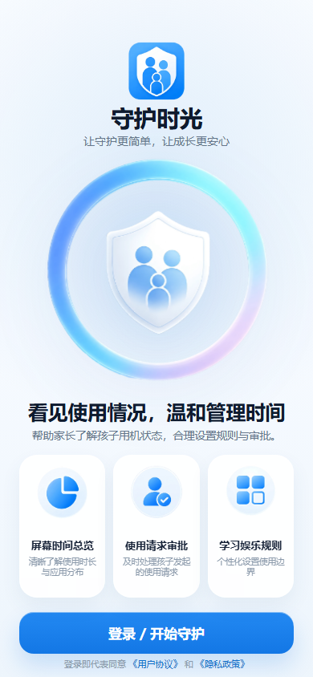

# App Lock Guardian

An Android app lock and guardian approval prototype. It combines a local Android app lock with a Cloudflare Worker based approval dashboard.

This project is intended as a portfolio and resume verification project. It is not an MDM product and does not claim system-level device-owner enforcement.

## What It Does

- Lets a user select apps to protect on Android.
- Uses Usage Access and an Accessibility Service to detect foreground app launches.
- Shows a lock screen or overlay when a protected app is opened.
- Supports guardian approval flows through a Cloudflare Worker dashboard.
- Includes a static student-side web UI embedded into the Android app assets.

## Tech Stack

- Native Android, Java, Gradle Kotlin DSL
- Android Usage Stats, Accessibility Service, foreground service, Device Admin receiver
- Cloudflare Workers, D1, static assets
- Plain HTML/CSS/JavaScript for the guardian and student web UI

## Screenshot



## Project Layout

- `源码/AppLockGuard` - Android app source.
- `源码/AppLockApprovalWeb` - Cloudflare Worker approval dashboard and API.
- `源码/guardian-parent-pwa` - static guardian-side PWA prototype assets.
- `文档` - design and workflow notes kept for project context.

## Local Development

Android:

```bash
cd 源码/AppLockGuard
./gradlew assembleDebug
```

Cloudflare Worker:

```bash
cd 源码/AppLockApprovalWeb
npm install
copy .dev.vars.example .dev.vars
npm run dev
```

Before deployment, replace `https://approval.example.com` in the Android and web assets with your own Worker domain, and replace the D1 database ID in `wrangler.toml`.

## Security Boundary

This is a semi-managed app lock prototype:

- It is not Android Device Owner or an enterprise MDM solution.
- It cannot fully prevent uninstalling, clearing app data, disabling permissions, or force stopping on all devices.
- MIUI/HyperOS and other aggressive Android distributions may require manual autostart and battery settings.
- Real production use would need stronger enrollment, signed release builds, backend hardening, and privacy review.

## Repository Hygiene

This public version excludes:

- APK/AAB files and signing keys
- build outputs, local Gradle files, Cloudflare caches, and logs
- temporary reference APKs and private working notes
- real Cloudflare resource IDs and personal custom domains

## License

MIT
